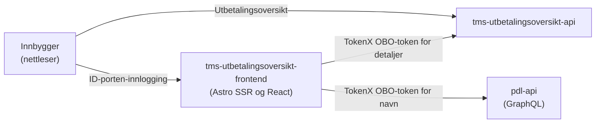

# tms-utbetalingsoversikt-frontend

## Formål

Frontend for utbetalingsoversikten på innloggede sider på nav.no. Her kan personbrukere:

- se kommende og tidligere utbetalinger
- filtrere utbetalinger på periode og ytelse
- åpne detaljer om en utbetaling
- skrive ut oversikten eller en enkelt utbetaling

Appen er bygget med Astro, React og Aksel. Brukeren autentiseres med ID-porten. Appen bruker TokenX til å hente utbetalingsdetaljer og personens navn fra bakenforliggende tjenester.

## Arkitektur

Oversikten hentes fra `tms-utbetalingsoversikt-api` i nettleseren. Detaljsider rendres på serveren, der brukerens token veksles til et on-behalf-of-token via TokenX før appen kaller utbetalings-API-et og PDL.

## Miljøer

- [Produksjon](https://www.nav.no/utbetalingsoversikt)
- [Development](https://www.intern.dev.nav.no/utbetalingsoversikt)
- [Development for ansatte](https://www.ansatt.dev.nav.no/utbetalingsoversikt)

## Backend-tjenester

### [tms-utbetalingsoversikt-api](https://github.com/navikt/tms-utbetalingsoversikt-api)

Leverer kommende og tidligere utbetalinger samt detaljer om en enkelt utbetaling.

- **GET** `/utbetalinger/alle`
- **GET** `/utbetalinger/ssr/{id}`

### [pdl-api](https://github.com/navikt/pdl)

Leverer personens navn til utskriftsvisningen via GraphQL.

- **POST** `/graphql`

## Utvikling

Prosjektet krever Node.js 24 eller nyere og bruker pnpm. Kjør `pnpm run` for en oppdatert oversikt over tilgjengelige kommandoer for lokal utvikling, bygging og testing.

Ved lokal utvikling er appen tilgjengelig på [http://localhost:4321/utbetalingsoversikt](http://localhost:4321/utbetalingsoversikt). Astro-integrasjonen `@navikt/astro-mocks` leverer lokale mockdata.

## Henvendelser

Spørsmål om koden eller prosjektet kan opprettes som [issues i GitHub](https://github.com/navikt/tms-utbetalingsoversikt-frontend/issues).

## For Nav-ansatte

Interne henvendelser kan sendes i [#team-minside på Slack](https://nav-it.slack.com/archives/C0912F59V29).
